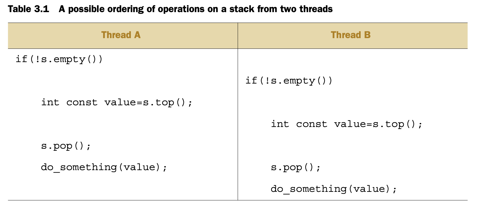

# Sharing Data Between Threads

## 3.1 Problems With Sharing Data Between Threads
- If all data is read only there is no problem
- If data is shared among threads, and it is read and write then problems can arise.
- An Invariant are statements that are always true about about something, in this case a data sturture. Invarients in concurrent code typically lead to race conditions.

### 3.1.1 Race conditions
- **Race Condition** - when the outcome of an event depends on the relative order of operations take place.

### 3.1.2 Avoiding Race Coniditons
- Wrap Data Structure in some protection mechanism (locks)
- Modify the design of data sructure and its invariants so that modifications are done as a series of indivisble changes. (LOCK FREE PROGRAMMIMNG). This is very difficult to achieve.
- Handle updates to the data stuctures as a *transaction*, just like updates to a database. These changes must be stored in a transaction log. If the tranaction cannot take place, since another thread has modifed the data structure. This is referred to as Software Tranactional Memeory (STM)

## 3.2 Protecting shared data with mutexes
- mark pieces of code that modify the shared memory as mutally exculsive. When a thread is accessing the data structure it obtains the lock, and then when it is done it will release the lock.

### 3.2.1 Using mutexes in C++
- Create an instance of a `std::mutex`, lock it with a call to `lock()` and unlock with a call to `unlock()`. It is not good pratice to call these functions directly. Need to remember to call `lock` and `unlock`.
- Standford C++ Library provides a `std::lock_guard` template, locks the mutex at construction, and unlocks it at destruction. `std::mutex` and `std::lock_guard` are provided in the `<mutex>` header file
``` C++
#include <list>
#include <mutex>
#include <algorithm>

std::list<int> some_list;
std::mutex some_mutex;

void add_to_list(int new_value) {
    std::lock_guard<std::mutex> guard(some_mutex);
    some_list.push_back(new_value);
}

bool list_contains(int value_to_find) {
  std::lock_guard<std::mutex> guard(some_mutex);
  return std::find(some_list.begin(),some_list.end(),value_to_find)
      != some_list.end();
}
```
- The `std::lock_guard` is similar to the `with` in python, it takes care of locking and unlocking the mutex, but it seems that the cricitcal part of the code must be in some function in order for this to take place.
- Rather than having global variables, we typically have the mutex in a class.
- Problem: Any code that has access to a pointer or a reference can now access (and potentially modify) the protected data, without locking the mutex.
### 3.2.2 Structing Code for Protecting Shared Data
- Need to ensure that functions are not passing pointers or references to their callers.
- Also need to ensure that these functions do not pass references or pointers to the functions that they call. They can store the pointer or reference and access it without the access of mutex.
- Here is an example of passing out a reference to protected data
``` C++
class some_data
{
    int a;
    std::string b;
public:
    void do_something();
};

class data_wrapper
{
private:
    some_data data;
    std::mutex m;
public:
    template<typename Function>
    void process_data(Function func)
    {
        std::lock_guard<std::mutex> l(m);
        func(data); // here we have a lock_guard, but it is unless since we are passing in protected data to another function
    }
};
some_data* unprotected;
void malicious_function(some_data & protected_data) {
  unprotected = & protected_data;
}

data_wrapper x;
void foo() {
    x.process_data(malicious_function);
    unprotected->do_something();
}
```
- The underlying problem with this code is that we are not protecting all of the code which is accessing data. In this case, we did not protect the function `foo`

### 3.2.3 Spotting Race Conditions Inherent in Interfaces.
- imagine you have a concurrent program, which has a doubly linked list. You need to ensure that you protects three pieces of data (in the case of deletion): the node which is being delted, and the node before the delted node, and the one after.
- The indivudal nodes do not need protection, but rather the whole data sturture needs protection
- Imagine you have a stack data structure, you would call the following calls on them: `empty()`, `size()`, `top()`, `push`, `pop`, and `swap`.
- The calls to empty, and size are essentially unless, even if the code is protected with mutexes, other threads are free to acess the stack and make any modifies that they wish.
- In singles threaded code, there is no problem. Here is an example of the code:
``` C++
stack<int> s;
if(!s.empty()) {
  int const value=s.top();
  s.pop();
  do_something(value);
}
```
- If this code was used in multithreaded instance, it would be useless. After the call of empty, another thread can delete an element in the stack, and then the top call would result in an error.
- The use of a mutex internally in the data structure is does not protect the stack data structure.
- To resolve you can throw an execption if the call to top is called on an empty stack, but this makes the call to empty proir redundant
- Additionally, a race condition also eixists between the call to top and pop. If two threads are running the same code, and acessing the same code, then one can call pop before the other, hence this could result in an error in the call to pop in the second thread. Additionally, one value is removed from the stack without doing anything to it.

Potential solutions
#### OPTION 1: PASS IN A REFERENCE
``` C++
std::vector<int> result;
some_stack.pop(result);
```
- for some types this is not pratical. lots of overhead to copy
#### OPTION 2: REQUIRE A NO-THROW COPY CONSTRUCTOR OR MOVE CONSTRUCTOR
- dont really understand this tbh
#### OPTION 3: RETURN A POINTER TO THE POPPED ITEM
- pointer can be freely copied without throwing an exception
- need to have memory management to handle memory allocated to the pointer.

Best solution is to use a combination of 1 and 2/3
``` C++
#include <exception>
#include <memory>
struct empty_stack: std::exception
{
    const char* what() const throw();
};
template<typename T>
class threadsafe_stack {
public:
    threadsafe_stack();
    threadsafe_stack(const threadsafe_stack&);
    threadsafe_stack& operator=(const threadsafe_stack&) = delete; // cannot assign a stack to another.
    void push(T new_value);
    std::shared_ptr<T> pop();
    void pop(T& value);
    bool empty() const;
};
```
### 3.2.4 Deadlock: the problem and a solution
- there are more than one lock, each thread has a seperate mutex, all of the mutexes are waiting for the others to release their lock. Now the threads are stuck in what is called a **Deadlock**.
- To avoid deadlock, you should always lock and unlock the threads in the same order. First you must obtain Lock A, than lock B, then when you are done, release lock B, than A.
- Can't always be done, mutexs are protecting a separate instance of the same class. Ex, data exchange between two instances of the same class, the mutexs on both instances must be locked. Can cause a dead lock.
- The solution to this is using `std::lock` - it can lock two or more mutexes without the risk of deadlock.
``` C++
class some_big_object;
void swap(some_big_object& lhs,some_big_object& rhs);
class X
{
private:
    some_big_object some_detail;
    std::mutex m;
public:
    X(some_big_object const& sd):some_detail(sd){}
    friend void swap(X& lhs, X& rhs)
    {
        if(&lhs==&rhs)
            return;
        std::lock(lhs.m,rhs.m);
        std::lock_guard<std::mutex> lock_a(lhs.m,std::adopt_lock);
        std::lock_guard<std::mutex> lock_b(rhs.m,std::adopt_lock);
        swap(lhs.some_detail,rhs.some_detail);
    }
};
```
Here first we check we have two different instances of the class X. Then both of the mutexes are locked using the `std::lock`. Finally, the `std::lock_guard` are constructed for each mutex, and `std::adapt_lock` is passed in, indicating that each mutex has already been locked.

### 3.2.5 Further Guidelines for avoiding Deadlock
#### Avoid Nested Locks
- if you need to accquire mutliple locks, try to do it in a single action using `std::lock`
#### Avoid Calling User Supplied Code While Holding a Lock
- you do not know what someonelse code may do, so try not to accquire locks when calling someone elses code./
#### Acquire locks in a fixed order
- Always get locks in the same order, and then release them in the opposite order.
#### Use a lock Hierarchy
- if a thread hold a lock from a lower index than the one it is attempting to accquire, it will not be able to obtain the lock.
``` C++
hierarchical_mutex high_level_mutex(10000);
hierarchical_mutex low_level_mutex(5000);
int do_low_level_stuff();
int low_level_func()
{
    std::lock_guard<hierarchical_mutex> lk(low_level_mutex);
    return do_low_level_stuff();
}
void high_level_stuff(int some_param);
void high_level_func()
{
    std::lock_guard<hierarchical_mutex> lk(high_level_mutex);
    high_level_stuff(low_level_func());
}
void thread_a()
{
    high_level_func();
}
hierarchical_mutex other_mutex(100);
void do_other_stuff();
void other_stuff()
{
    high_level_func();
    do_other_stuff();
}
void thread_b()
{
    std::lock_guard<hierarchical_mutex> lk(other_mutex);
    other_stuff();
}
```
- `thread_a()` will work fine, but `thread_b()` will fail at run time.
- `thread_a()` calls `high_level_func()`, locking `high_level_mutex`, then calls `low_level_func()`, locking `low_level_mutex`
- thread_b locks other_mutex, which only has a value of 100, thus it will not be able to obtain the high_level_mutex. This will throw an exception, causing the program to stop running.

Here is the implmentation of the hierarchical_mutex:
``` C++
class hierarchical_mutex
{
    std::mutex internal_mutex;
    unsigned long const hierarchy_value;
    unsigned long previous_hierarchy_value;
    static thread_local unsigned long this_thread_hierarchy_value;
    void check_for_hierarchy_violation()
    {
        if(this_thread_hierarchy_value <= hierarchy_value)
            throw std::logic_error(“mutex hierarchy violated”);
    }
    void update_hierarchy_value()
    {
        previous_hierarchy_value=this_thread_hierarchy_value;
        this_thread_hierarchy_value=hierarchy_value;
    }
public:
    explicit hierarchical_mutex(unsigned long value):
        hierarchy_value(value),
        previous_hierarchy_value(0)
    {}
    void lock()
    {
        check_for_hierarchy_violation(); internal_mutex.lock();
        update_hierarchy_value();
    }
    void unlock()
    {
        this_thread_hierarchy_value=previous_hierarchy_value;
        internal_mutex.unlock();
    }
    bool try_lock()
    {
        check_for_hierarchy_violation();
        if(!internal_mutex.try_lock())
            return false;
        update_hierarchy_value();
        return true;
    }
};
thread_local unsigned long
    hierarchical_mutex::this_thread_hierarchy_value(ULONG_MAX);
```
### 3.2.6 Flexible locking with std::unique_lock
- `std::unique_lock` is much more flexible than `std::lock_guard`
- does not own the mutex
``` C++
class some_big_object;
void swap(some_big_object& lhs,some_big_object& rhs);
class X
{
private:
    some_big_object some_detail;
    std::mutex m;
public:
    X(some_big_object const& sd):some_detail(sd){}
    friend void swap(X& lhs, X& rhs)
    {
        if(&lhs==&rhs)
            return;
        std::unique_lock<std::mutex> lock_a(lhs.m,std::defer_lock);
        std::unique_lock<std::mutex> lock_b(rhs.m,std::defer_lock);
        std::lock(lock_a,lock_b);
        swap(lhs.some_detail,rhs.some_detail);
    }
};
```
### 3.2.7 Transferring mutex ownership between scopes
- can pass ownership around of a unqiue_lock very easily.


## 3.3 Alternative facilities for protecting shared data
- One case that comes up often where the shared data needs protection only from concurrent access while it’s being initialized, but after that no explicit synchronization is required. Data is read only after it is created.
### 3.3.1 Protecting shared data during initialization
- you can have a shared resource that is expensive to construct, such that you would want to **Lazy initialize** it. Common in single threaded applications- each application that needs the resource will check if the resource has been created.
``` C++
std::shared_ptr<some_resource> resource_ptr;
std::mutex resource_mutex;
void foo()
{
    std::unique_lock<std::mutex> lk(resource_mutex);
    if(!resource_ptr)
    {
        resource_ptr.reset(new some_resource);
    }
    lk.unlock();
    resource_ptr->do_something();
}
```
- This may seem like a good way to create the shared resource, however, everythread has to wait for its turn in order to check if it has been allocated.
- So what to do instead?
```C++

void undefined_behaviour_with_double_checked_locking()
{
    if(!resource_ptr)
    {
        std::lock_guard<std::mutex> lk(resource_mutex);
        if(!resource_ptr)
        {
            resource_ptr.reset(new some_resource);
        }
    }
    resource_ptr->do_something();
}
```
- some other stuff, but it does not seem as important, so we will leave chapter 3 at that
