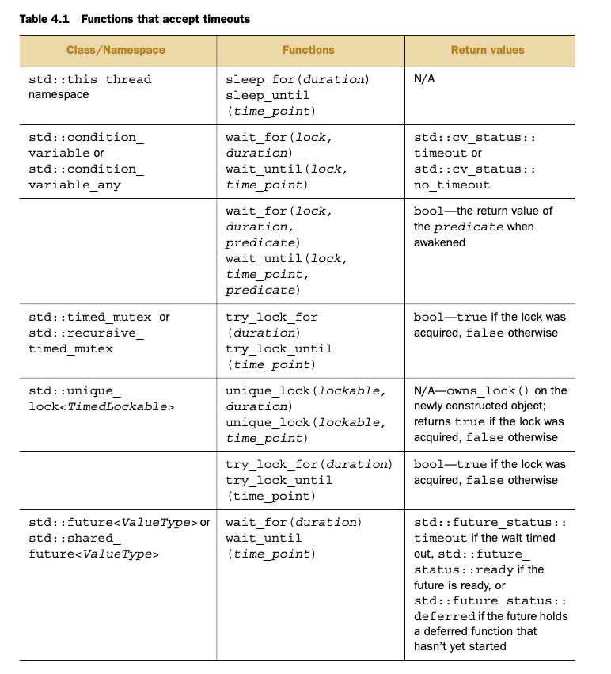
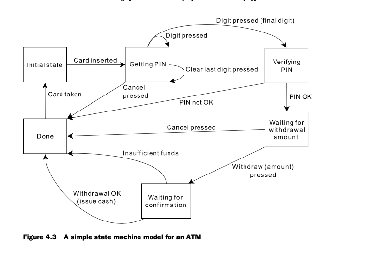

## Synchronizing concurrent operations

## 4.1 Waiting for an event or other condition
- When one thread is waiting for another thread to finish up its task (release
the mutex), it can do one of three things. A, keep checking to see if the
mutex has been release. This is wasting lots of time, and processing resources
that can be used by other threads in the mean time. B is to have the thread
sleep for short periods of time, using the `std::this_thread::sleep_for()`
function.

```C++
bool flag;
std::mutex m;
void wait_for_flag()
{
    std::unique_lock<std::mutex> lk(m);
    while(!flag)
    {
        lk.unlock();
        std::this_thread::sleep_for(std::chrono::milliseconds(100));
        lk.lock();
    }
}
```
- before the sleep the mutex unlocks the thread, and then after waking up it
locks the thread again. This is great since the thread does not waste any
compute resources while it is sleeping. However, this still wastes a lot of
time!
- The final options is the preferred one. Use a conditional variables, the
thread actually waits for the other to complete its work.
- Condition variable associated with some event of condition, when a thread
knows that the condition has been met, it can notify other threads.This will
wake up the waiting threads.

### 4.1.1 Waiting for a condition with condition variables
- The Standard C++ Library provides not one but two implementations of a
condition variable: `std::condition_variable` and `std::condition_variable_any`.
Both are located in the `<condition_variable>` header file.
- Example of using `std::condition_variable`:

``` C++
std::mutex mut;
std::queue<data_chunk> data_queue;
std::condition_variable data_cond;
void data_preparation_thread()
{
    while(more_data_to_prepare())
    {
        data_chunk const data = prepare_data();
        std::lock_guard<std::mutex> lk(mut);
        data_queue.push(data);
        data_cond.notify_one();
    }
}
void data_processing_thread()
{
    while(true)
    {
        std::unique_lock<std::mutex> lk(mut);
        data_cond.wait(
        lk,[]{return !data_queue.empty();});
        data_chunk data=data_queue.front();
        data_queue.pop();
        lk.unlock();
        process(data);
        if(is_last_chunk(data))
            break;
    }
}
```
- A queue is used to pass data between the threads.
- When the data is ready, the thread preparing the data locks the mutex, and
pushes data onto the queue, Then using the condition variable notifies a thread
that it is done if there is one waiting.
- There is also a data processing thread. The thread locks the mutex first.Then
the condition variable calls wait, which passes the lock object, and waits for
the queue to not be empty. If the queue is empty, the conditon variable will
unlock the mutex, otherwise it will keep it lock.
- If the condition variable returns false, then the thread will be put in the
waiting state, and then when notified, it will obtain the lock and then continue.
- A `std::unique_lock` is used rather than a `std:lock_guard` since a waiting
thread can unlock the mutex, and locked again afterward.
- The function in the call to `wait` can be called many times, and be abandoned
at any time, so it is best that the function does not have side effects.

##### 4.1.2 Building a Thread safe queue with condition variables.
- Three basic operations for a queue:
  - query the state of the queue (`empty()`, `size()`)
  - modify the queue
  - query the elements of queue.
- The same race condition exist as before, need to combine the calls to front
and pop, and top and pop.
- Instead we can have two different functions: `try_pop()`: returns immedaitely
indicating success or failure. `wait_and_pop()`: wait until there is a value to
retrived.
- Here is the class:

```C++
#include <memory>
template<typename T>
class threadsafe_queue
{
public:
  threadsafe_queue();
  threadsafe_queue(const threadsafe_queue&);
  threadsafe_queue& operator=(
     const threadsafe_queue&) = delete;
  void push(T new_value);

  bool try_pop(T& value);
  std::shared_ptr<T> try_pop();

  void wait_and_pop(T& value);
  std::shared_ptr<T> wait_and_pop();

  bool empty() const;
};
```
- Cannot assign the assignment of the queue for simplicity.
- The first version of `try_pop()` stores a reference to a variable to store
the result. The second version returns a pointer to the value, if there is not
a value it will return a `nullptr`.

```C++
#include <queue>
#include <mutex>
#include <condition_variable>
template<typename T>
class threadsafe_queue
{
private:
    std::mutex mut;
    std::queue<T> data_queue;
    std::condition_variable data_cond;
public:
    void push(T new_value)
    {
      std::lock_guard<std::mutex> lk(mut);
      data_queue.push(new_value);
      data_cond.notify_one();
    }
    void wait_and_pop(T& value)
    {
      std::unique_lock<std::mutex> lk(mut);
      data_cond.wait(
        lk,[this]{return !data_queue.empty();}
      );
      value=data_queue.front();
      data_queue.pop();
    }
};
threadsafe_queue<data_chunk> data_queue;
void data_preparation_thread()
{
    while(more_data_to_prepare())
    {
      data_chunk const data=prepare_data();
      data_queue.push(data);
    }
}
void data_processing_thread()
{
    while(true)
    {
      data_chunk data;
      data_queue.wait_and_pop(data);
      process(data);
      if(is_last_chunk(data))
        break;
    }
}
```
- Both the mute and the condition variable and contained in the threadsafe
class
- Condition variables can be used in when there are any threads waiting for the
mutex. Instead you can use `notify_all` which triggers all the threads calling
wait to check their condition variable.

## 4.2 Waiting for One-Off events with futures.
- If you there is a one time event, a thread can obtain a "future" which
represents this object. Then the thread can periodically check if the event has
occured, while performing some other task. Once the future value has been
obtained, it cannot be reset.
- C++ has two different types of futures located n the `<future>` header file
  - A unique future `std::future<>`
  - A shared future, `std::shared_future<>`
- A `shared_future` can represent many instances of one event.
- The `std:future<void>` , `std::shared_future<void>` should be used where
there’s no associated data, just waiting for the event to occur.
- Futures are used to communicate between threads, but they must be protected by
a mutex if being accessed by multiple threads.

### 4.2.1 Returning values from background tasks
- Suppose that you need to run some functions to obtain a result, however, it,
takes a really long time to compute. A future can be used here instead.
- `std::async` may also be used so that the result can be obtained, here is an
example:
```C++
#include <future>
#include <iostream>
int find_the_answer_to_ltuae();
void do_other_stuff();
int main() {
    std::future<int> the_answer=std::async(find_the_answer_to_ltuae);
    do_other_stuff();
    std::cout<<"The answer is "<<the_answer.get()<<std::endl;
}
```

### 4.2.2 Associating a task with a future.
- `std::packaged_task<>` associates a future with a function or callable object.
When invoked, it calls the object/function and makes the future read. This can
be used in thread pools
- the template parameter for the `std::packaged_task` is a function signature.
Can have `void()` or can have something like `int(std::string &, double)`. Types
do not have to be an exact match.
- The return type for these functions specifies the type of the `std::future<>`
and the return value is obtained from the function call `get_future()`. The
argument list is used to specify the signature list of the packaged task's
function all operator.
- A `std::packagedtask<>` is a callable object, which can be wrapped in a
`std::function` object, so it can be passed to a `std::thread` object. When
invoked as a function object, the result is stored in a `std::future` object,
obtained from the `get_future()`
- Here is an example of this being used in a GUI application. GUIs typically
have different threads working on updating the it, so the GUI application must
inform these threads to do so. A `std::packaged_task` can be used to do so,
without sending a custom message to each thread.
```C++
#include <deque>
#include <mutex>
#include <future>
#include <thread>
#include <utility>

std::mutex m;
std::deque<std::packaged_task<void()> > tasks;
bool gui_shutdown_message_received();
void get_and_process_gui_message();

void gui_thread()
{
  while(!gui_shutdown_message_received())
  {
    get_and_process_gui_message();
    std::packaged_task<void()> task;
    {
      std::lock_guard<std::mutex> lk(m);
      if(tasks.empty())
        continue;
      task=std::move(tasks.front());
      tasks.pop_front();
    }
    task();
  }
}

std::thread gui_bg_thread(gui_thread);
template<typename Func>
std::future<void> post_task_for_gui_thread(Func f)
{
  std::packaged_task<void()> task(f);
  std::future<void> res=task.get_future();
  std::lock_guard<std::mutex> lk(m);
  tasks.push_back(std::move(task));
  return res;
}
```
- The function `gui_thread` continues to loop until it recives a message from
the GUI. If there is something in the queue, it removes that task from the
queue, and then it releases it lock, and then it runs the specfic task. The
future will be relases when the task is done.

### Making Promises:
- A `std::promise<T>` can be used to set a value of type T, which can be read by
A pair of `std::thread` and `std::promise` can be used in the following case:
  - waiting thread could block the future, while the thread that is providing
  the data could use the promise to set the value, and make the future ready.
- When the value of a promise is set with a call to `set_value()`, the future
becomes ready, can be used to retrive the stored value. If the promise is
destoryed before setting a value, then an exception is stored instead.
- Here is an example of how a promise/future pair can be used to top identify
the sucessful trasmission of a block of outgoing data. The value associated with
the future is a sucess/fail fla, and for incoming packets, the future is the
paylod of the data packet.
```C++
#include <future>
void process_connections(connection_set& connections)
{
  while(!done(connections))
  {
    for(connection_iterator
          connection=connections.begin(),end=connections.end();
        connection!=end; ++connection)
    {
      if(connection->has_incoming_data())
      {
        data_packet data=connection->incoming();
        std::promise<payload_type>& p =
          connection->get_promise(data.id);
        p.set_value(data.payload);
      }
      if(connection->has_outgoing_data())
      {
        outgoing_packet data =
          connection->top_of_outgoing_queue();
        connection->send(data.payload);
        data.promise.set_value(true);
      }
    }
  }
}
```
### 4.2.4 Saving an exception for the future.
- Imagine the following code:
```C++
double square_root(double x)
{
  if(x<0)
    throw std::out_of_range(“x<0”);
  return sqrt(x);
}
```
If you were the call this function asynchronuosly, this would not work
- In order to work with exceptions, you would call set_exception rather than
set_value. Here is how the code would work:
```C++
extern std::promise<double> some_promise;
try {
  some_promise.set_value(calculate_value());
}
catch(...) {
  some_promise.set_exception(std::current_exception());
}
```
- Another way to set the exceptions is to destory the `std::packaged_value` or
the `std::promise`.
### 4.2.5 Waiting for Multiple Threads
- You can use `std::shared_future`, since it is can be shared with many threads.
- `std::future` is movable, but `std::shared_future` is copyable.

## 4.3 Waiting with a time limit
- Sometimes you want to specify how long a thread should wait for something to
happen.
- `std::condition_variable` has two overloads of the `wait_for()` member
function and two overloads of the `wait_until()` member function that correspond
to the two overloads of `wait()` — one overload that just waits until signaled,
or the timeout expires, or a spurious wakeup occurs, and another that will check
the supplied predicate when woken and will return only when the supplied
predicate is true (and the condition variable has been signaled) or the timeout
expires.

```C++
#include <condition_variable>
#include <mutex>
#include <chrono>

std::condition_variable cv;
bool done;
std::mutex m;
bool wait_loop()
{
  auto const timeout = std::chrono::steady_clock::now()+
                      std::chrono::milliseconds(500);
  std::unique_lock<std::mutex> lk(m);
  while(!done)
    if(cv.wait_until(lk,timeout)==std::cv_status::timeout)
      break;
  return done;
}
```
- Plain `std::mutex` and `std::recursive_mutex` do not support time outs, but,
`std::timed_mutex` and `std::recurisve_timed_mutex` do. They support
`try_lock_for()` and `try_lock_until()` to obtain a lock in a specified time, or
before a ceratin time.
- This is a table of the different objects that accept timeouts.


## 4.4 Using synchronization of operations to simplify code
- synchronization allows for a functional programming style.
- Each task can be provided with the data that it neededs, and the results can
be passed along the threads, with the use of futures.

### 4.4.1 Functional Programming with Futures
- Functional Programming: when the results of a function call on depends on the
arguments passed to the function, not the state of the external state of the
code. Similar to functions in math.
- A pure function does not modify the external state, the effect of the function
is limited to the return value of the function.
- Functional programming makes Concurrency easier to deal with. The shared data
will not be modified, no race conditions, and no need for mutexes.
- C++11 makes it easier to write functional programs.
- Futures can be passed around threads, but their is no direct access to the
shared data

#### FP Stlye QuickSort
- QuickSort: Take a pivot element, divide the list into items less than the
pivot and greater than the pivot; and then do the same on each of these lists,
and then combine all of these lists.
Sequential implmentation of QuickSort:
```C++
template<typename T>
std::list<T> sequential_quick_sort(std::list<T> input)
{
  if(input.empty())
    return input;
  std::list<T> result;
  result.splice(result.begin(),input,input.begin());
  T const& pivot=*result.begin();

  auto divide_point = std::partition(input.begin(),input.end(),
      [&](T const& t){return t<pivot;});

  std::list<T> lower_part;
  lower_part.splice(lower_part.end(),input,input.begin(), divide_point);

  auto new_lower(
    sequential_quick_sort(std::move(lower_part)));
  auto new_higher(
    sequential_quick_sort(std::move(input)));

  result.splice(result.end(),new_higher);
  result.splice(result.begin(),new_lower);
    return result;
}
```
- This code is already functional, so it is easy to make it concurrent:
```C++
template<typename T>
std::list<T> parallel_quick_sort(std::list<T> input)
{
  if(input.empty())
    return input;
  std::list<T> result;
  result.splice(result.begin(),input,input.begin());
  T const& pivot=*result.begin();
  auto divide_point=std::partition(input.begin(),input.end(),
        [&](T const& t){return t<pivot;});
  std::list<T> lower_part;
  lower_part.splice(lower_part.end(),input,input.begin(), divide_point);
  std::future<std::list<T> > new_lower(
    std::async(&parallel_quick_sort<T>,std::move(lower_part)));
  auto new_higher(parallel_quick_sort(std::move(input)));
  result.splice(result.end(),new_higher);
  result.splice(result.begin(),new_lower.get());
  return result;
}
```
- The major difference here is we are using a future, which is to sort the lower
half of the list, and it is done on another thread.

#### 4.4.2 Synchronizing operations with message passing
- CSP: Communicatiing Sequential Processes, threads are considered to be
separate, their is no shared data, but the threads there are communication
structures for the threads to send messages between each other.
- Each thread is like a state machine, when it recieves a message, it updates
it updates its state in some manner, and it will send one or more messages to
the other threads.
- Here is an example of a state machine for an atm. There would be three
threads: one for a hardware, one to handle the ATM logic, and the other to
communicate with the bank.

```C++
struct card_inserted
{
  std::string account;
};
class atm {
  messaging::receiver incoming;
  messaging::sender bank;
  messaging::sender interface_hardware;
  void (atm::*state)();

  std::string account;
  std::string pin;
void waiting_for_card() {
  interface_hardware.send(display_enter_card());
  incoming.wait()
    .handle<card_inserted>(
      [&](card_inserted const& msg) {
        account=msg.account;
        pin="";
        interface_hardware.send(display_enter_pin());
        state=&atm::getting_pin;
      }
    );
}

void getting_pin();
public:
  void run() {
    state = &atm::waiting_for_card;
    try {
      for(;;)
        (this->(*state))();
    } catch(messageing::close_queue const &) {}
  }
};
```
