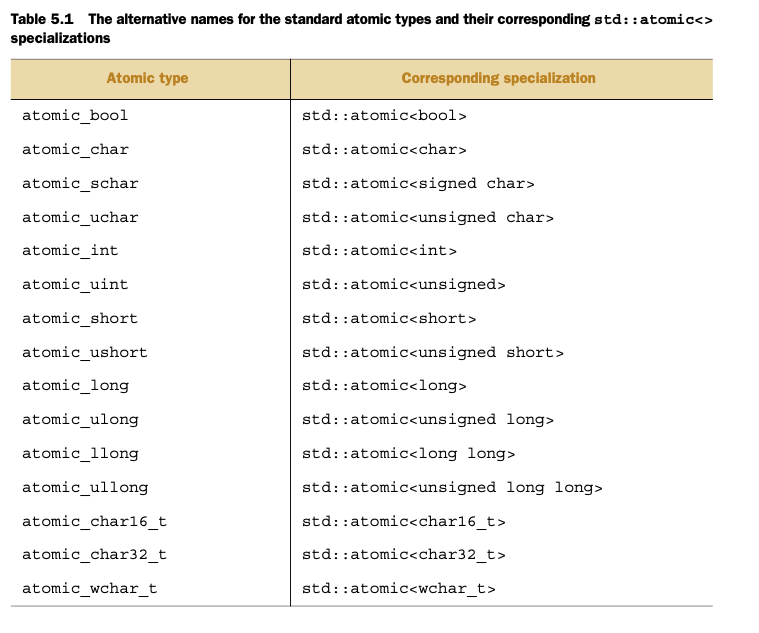

# 5: The C++ memory model and operations on atomic types

## 5.1 Memory Model Basics
- Two parts of memory model:
  - structural: how things are laid out in memory
  - concurrency: dependent on the structarl part.

### 5.1.1 Objects and Memory locations
- every variable is an object and every object occupies atleast one memory
location
- fundamental types take up one memory location

### 5.1.2 Objects, memory locations and Concurrency
- mutexes are used to prevent race conditions, but atmoic operations can also be
used to enfore an ordering between access of data between threads.
- if there is no enforced ordering between two accesses to a single memory
location, than the accesses are not atomic, or they access(es) are writes,
which causes a data race, which is undefined behaviour

### 5.1.3 Modifications Orders
- Every program has a defined modification order (all of the writes to the
object from the threads in te program, including initialization). This order
varies from each run, but all of the threads must agree on this order.
- If an object is not an atmoic type, then there must be sufficient
synchronication to ensure that threads agree on a modification order for this
object. Using atomic operations the compiler will be responsible for ensuring
synchronization among threads.

## 5.2 Atomic Operations and types in C++
- atmoic operation: indivisible operations

### 5.2.1 Standard Atomic Types
- found in the `<atomic>` header, they are only atmoic in C++ syntac, interally
by the compiler, they may be done using locks. This can be checked using the
function `is_lock_free()`: true means the compiler did not use a mutex, false
means that the compiler does use a mutex.
- The only types that does not have the function `is_lock_free()` is
`std::atomic_flag` since it is required to be lock free. The only two functions
that it supports are `clear()` and `test_and_set()`.
- Remaning atmoic types are accessed using the `std::atomic<>` class template
.
- standard atmoic types are not copyable, nor are they assignable (do not have
copy constructors or copy assignment operators). They support the following
functions:
  - `load()`
  - `store()`
  - `exchange()`
  - `compare_exchange_weak()`
  - `compare_exchange_strong()`
- The operations are separated into three different classes:
  - Store, Load, Read-modifify-Write.

### Operations on `std::atomic_flag`
- simplest atmomic type, must be initialized with `ATOMIC_FLAG_INIT` which
intializes the flag to a clear state: `td::atomic_flag f=ATOMIC_FLAG_INIT`
- can be `clear()`, `test_and_set()` or destoryed.

